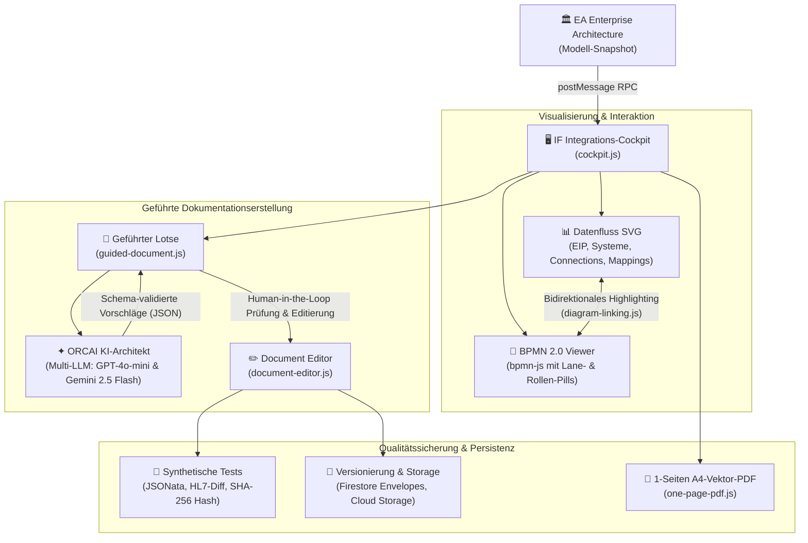

# ORCAI IF · Integrations-Cockpit & Schnittstellen-Lotse

[](#)
[](https://orcai-54321.web.app/)
[](#)
[](#)

> **Mission:**  
> **Das Integrations-Cockpit (IF) nimmt den Interface-Entwickler bei der Definition der Interface-Dokumentation an die Hand, führt strukturiert durch den bürokratischen Akt und generiert dabei so viel als irgendmöglich selbst.**

---

## Verknüpfte Dienste & Ressourcen

| Dienst / Ressource | Beschreibung | Link |
| :--- | :--- | :--- |
| **IF Integrations-Cockpit** | Live-Webanwendung des Interface-Cockpits | [orcai-54321.web.app/if/](https://orcai-54321.web.app/if/?model=ORCAI-MODEL-JOHANNESSTIFT-DIAKONIE-EA&int=JSD-INT-01) |
| **ORCAI Plattform & Persistenz** | Mandantenfähiger Persistenz-Dienst (Firestore & Storage) | [orcai-54321.web.app](https://orcai-54321.web.app/) |
| **EA Enterprise Architecture** | Interaktive Gesamtarchitektur & Systemlandkarten | [orcai-54321.web.app/ea/](https://orcai-54321.web.app/ea/) |
| **App-Dokumentation** | Ausführliches Hilfedokument `ORCAI-260922-01H00-MD-IFHLP` | [docs/ORCAI-260922-01H00-MD-IFHLP.md](./docs/ORCAI-260922-01H00-MD-IFHLP.md) |
| **GitHub Repository** | Quellcode-Repository | [github.com/gonzo42nixon/if](https://github.com/gonzo42nixon/if) |

---

## Architektur & Kernkonzept



---

## Hauptfunktionen

### 1. Schnelleinstieg & Enterprise-Architecture-Integration
- **Direktlink per URL**: `?model=ORCAI-MODEL-JOHANNESSTIFT-DIAKONIE-EA&int=JSD-INT-01`
- **Nahtlose Übergabe**: Direktsprung aus dem EA-Inspektor mit flüchtigem Sitzungsstand (`handoff`) oder aktuellem Modellstand.
- **Kryptografische Integrität**: SHA-256-Quellen-Hash über alle dokumentierten Entitäten (unter Bereinigung volatiler Zeitstempel).

### 2. Visueller Datenfluss & BPMN-Deep-Link
- **Enterprise Integration Patterns (EIP)**: Visuelle Darstellung von Quell-/Zielsystemen, logischen Stores, Middleware-Brokern, Adaptern und Protokollen.
- **Bidirektionale Kopplung (`diagram-linking.js`)**: Mouse-Over oder Klick im Datenfluss markiert sofort die zugehörigen MessageFlows, Lanes und Aktivitäten im BPMN-Viewer – und umgekehrt.
- **Rollen- & UX-Layer**: Rollen (z. B. Pflegepersonal, Laborarzt, RTW-Besatzung) werden als interaktive Badges dargestellt.

### 3. Der 10-Kapitel-Standard & Reifegrad-Ampel
Jede Schnittstelle wird strukturiert nach 10 standardisierten Kapiteln erfasst:
1. **Metadaten und Änderungsstand**
2. **Management Summary** (Nutzen, Kritikalität, Volumen, SLA)
3. **Kontext und Geltungsbereich** (In-/Out-of-Scope, Verantwortliche)
4. **Systeme und Schnittstellen** (Endpunkte, Authentifizierung, Timeouts)
5. **Architektur und Entscheidungen** (Muster, Idempotenz, Transaktionsgrenzen)
6. **Nachrichten und Mapping** (Felder, Transformationen, Defaults)
7. **Fehlerbehandlung und Wiederanlauf** (Retry, Dead-Letter-Queue, Replay)
8. **Monitoring und Betrieb** (Metriken, Alarme, Runbooks)
9. **Tests und Abnahme** (Synthetische Testfälle, Akzeptanzkriterien)
10. **Anhänge und offene Punkte** (Glossar, Klärungsbedarfe mit Frist)

Der **Reifegrad** wird transparent mit Ampelfarben (Grün: 100 %, Gelb: ≥ 50 %, Rot: < 50 %) ausgewiesen.

### 4. Der KI-Architekt als Lotse ("Nächster Schritt?")
Der integrierte KI-Assistent unterstützt den Entwickler interaktiv:
- **Automatische Lückenerkennung**: Findet die nächste unvollständige Angabe.
- **Strikte Guardrails**: Der Agent gibt ausschließlich schema-validiertes JSON aus. Er darf weder Freigaben noch Sicherheits-Credentials erfinden.
- **Multi-LLM-Zweitgutachten**: Neben dem Erstentwurf (z. B. via `openai/gpt-4o-mini`) kann per Knopfdruck ein unabhängiges Gegengutachten (via `google/gemini-2.5-flash`) eingeholt werden.
- **Menschliche Kontrolle**: Der Entwickler prüft, editiert und bestätigt jeden Text vor der Übernahme.

### 5. Versionierung & 1-Seiten-A4-Export
- **Unveränderliche Versionen**: Jede Freigabe oder Übernahme wird als neue Dokumentversion in Google Cloud Storage und Firestore transaktionssicher abgelegt.
- **One-Page-PDF (`one-page-pdf.js`)**: Generiert ein kompaktes, einseitiges DIN-A4-PDF mit Vektorgrafiken des Datenflusses, BPMN-Auszügen, Reifegradmatrix und dynamischem QR-Code.

---

## Projektstruktur

```
├── index.html                   # Hauptseite des Interface-Cockpits
├── cockpit.js                   # Cockpit-Controller, Rendering & Ereignissteuerung
├── cockpit.css                  # Haupt-Styling des Cockpits
├── cockpit-model.js             # Modell-Validierung & URL-Parameter
├── data-flow.js                 # SVG-Generierung des EIP-Datenflusses
├── data-flow.css                # Styling des Datenflusses & Interaktionen
├── diagram-linking.js           # Bidirektionale Verknüpfung Datenfluss <-> BPMN
├── process-diagrams.js          # BPMN 2.0 Viewer-Einbettung
├── process-diagrams.css         # Styling der Diagrammkarten
├── guided-document.js           # Geführter Lotse & interaktive KI-Fortschreibung
├── document-editor.js           # Versionierter Dokumenteneditor & Reifegrad
├── document-editor.css          # Styling der Bearbeitungsdialoge
├── document-versions.js         # Firestore & Storage Versionierungsschicht
├── one-page-pdf.js              # DIN-A4-Vektor-PDF-Generator (pdf-lib)
├── compact-layout.js / .css     # Kompaktes Metadaten-Layout & QR-Code
├── shell.js / shell.css         # App-Shell & Drawer-Integration
├── shared.css / app-launcher.*  # ORCAI Shared UI & Anwendungswechsler
├── firebase-config.js           # Firebase-Konfiguration
│
├── ea/                          # Enterprise Architecture Schnittstellenmodule
│   ├── integration-document-guide.js    # 10-Kapitel-Definition & Feldregeln
│   ├── integration-document-sources.js  # Hashing (SHA-256) & Snapshots
│   ├── integration-document-details.js  # Mapping-Tests & HL7-Diff
│   ├── if-agent-bridge.js               # PostMessage-Bridge zum KI-Architekten
│   ├── if-agent-layout.css              # Styling des eingebetteten KI-Drawers
│   └── vendor/pdf-lib-1.17.1.min.js     # PDF-Engine
│
├── vendor/                      # Externe Drittanbieter-Bibliotheken
│   ├── bpmn-navigated-viewer-18.29.1.min.js # BPMN.js Viewer
│   ├── diagram-js-18.29.1.css               # BPMN.js Styles
│   └── qrcode.js                            # QR-Code-Generator
│
└── docs/                        # Dokumentation
    └── ORCAI-260922-01H00-MD-IFHLP.md       # Ausführliches Hilfedokument
```

---

## Lokale Entwicklung

Die Anwendung besteht aus standardkonformen Vanilla-ES-Modulen und benötigt keinen schwerfälligen Build-Schritt.

```bash
# 1. Repository klonen
git clone https://github.com/gonzo42nixon/if.git
cd if

# 2. Lokalen Webserver starten (z. B. via Python oder Node)
# Mit Python:
python -m http.server 8080

# Oder mit Node:
npx serve .

# 3. Im Browser öffnen
http://localhost:8080/?model=ORCAI-MODEL-JOHANNESSTIFT-DIAKONIE-EA&int=JSD-INT-01
```

---

## Lizenz & Urheberrecht

Entwickelt für die **ORCAI Plattform** & Enterprise Architecture im Gesundheitswesen.  
Alle Rechte vorbehalten.
